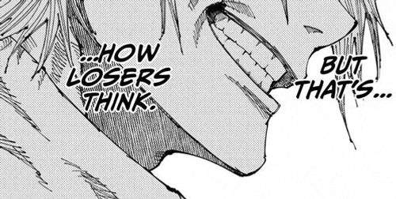

# Phase Two: Rebuilding the Engine Properly

> “Good artists copy. Great artists steal.”  
> — some wise giga🥷

 I’m stealing from myself.

The Chess Engine I was working on is done:  
PVP over the board, moderately good UI, full rule enforcement.
The project is complete and dusted

The long-term goal is to build a machine learning model trained on data from the Lichess Open Database so the engine can eventually learn to play on its own.

Not touching ML yet.

Before that, I want to rebuild things the right way.

## So why am I doing this?
We (yes we) will be
- Optimizing the current architecture  
- Rebuilding the core logic in a low-level language like C  
- Pushing performance and structural design as far as possible  
- Implementing a proper minimax algorithm for positional evaluation  

Only after that foundation is solid will I move toward a complete AI model

This is the part where things get real.

Till then check ts out:

---

## Current Chess Engine (Python – Phase One)

Repository:  
https://github.com/SaqibMasoodi/ChessEngine